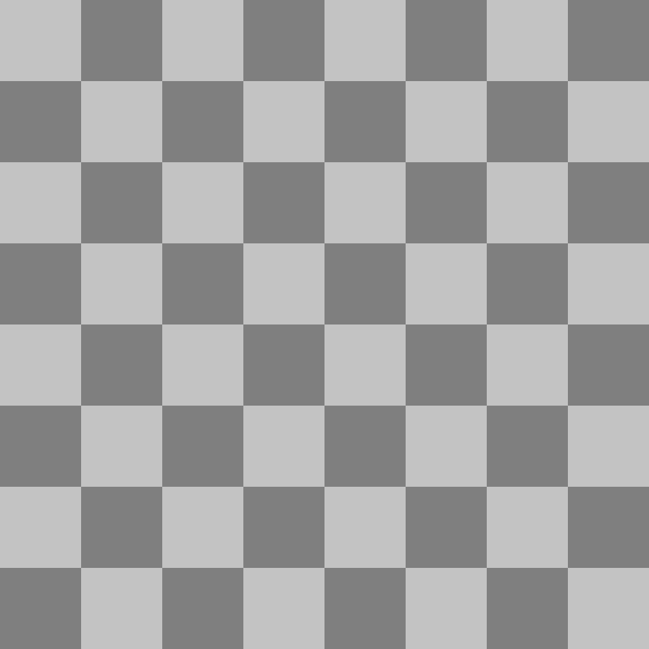
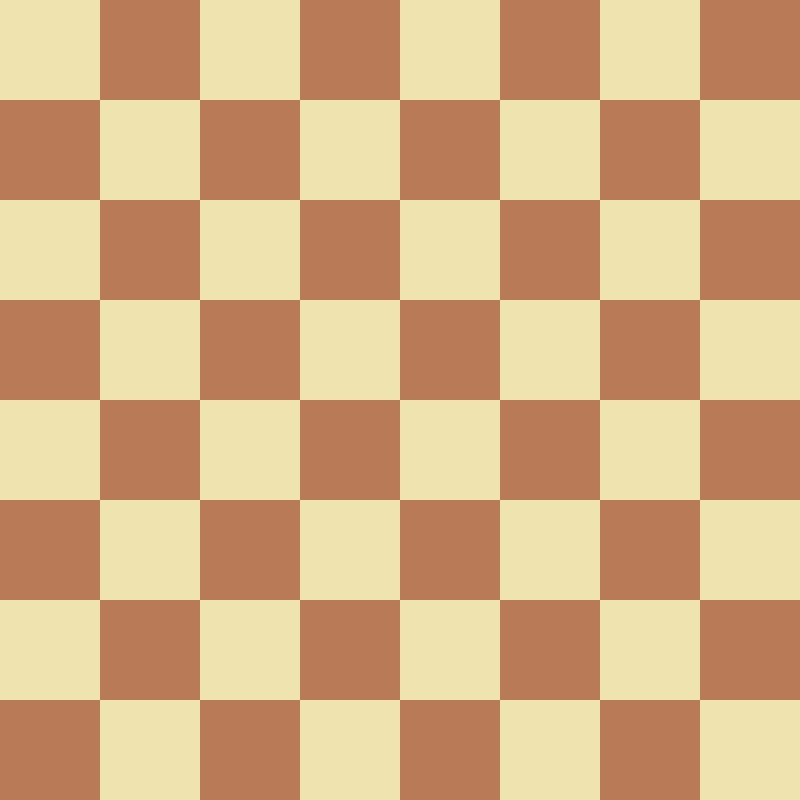
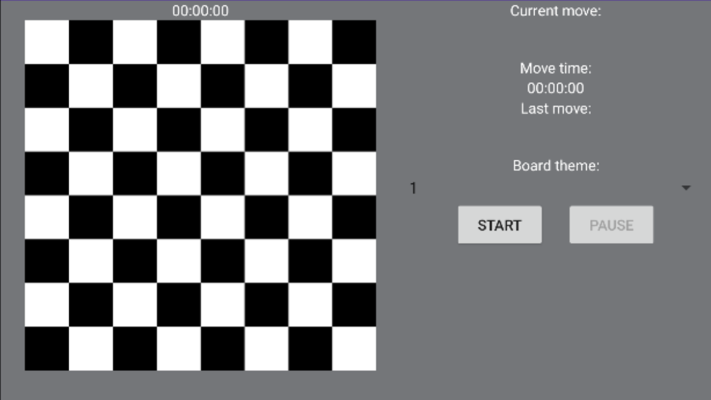
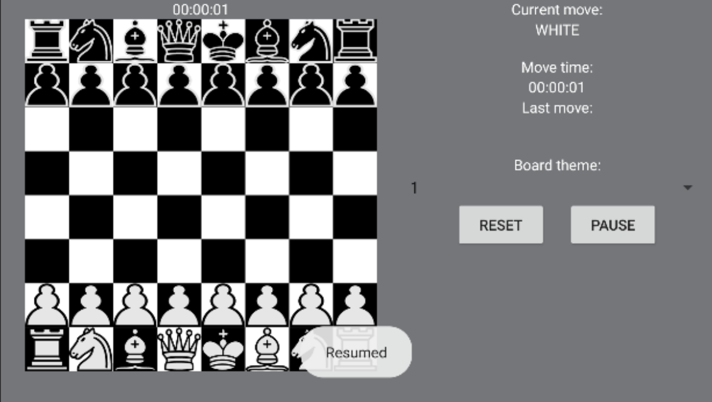
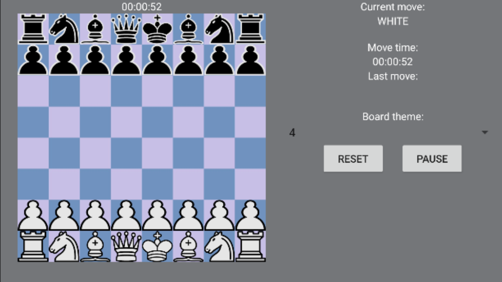
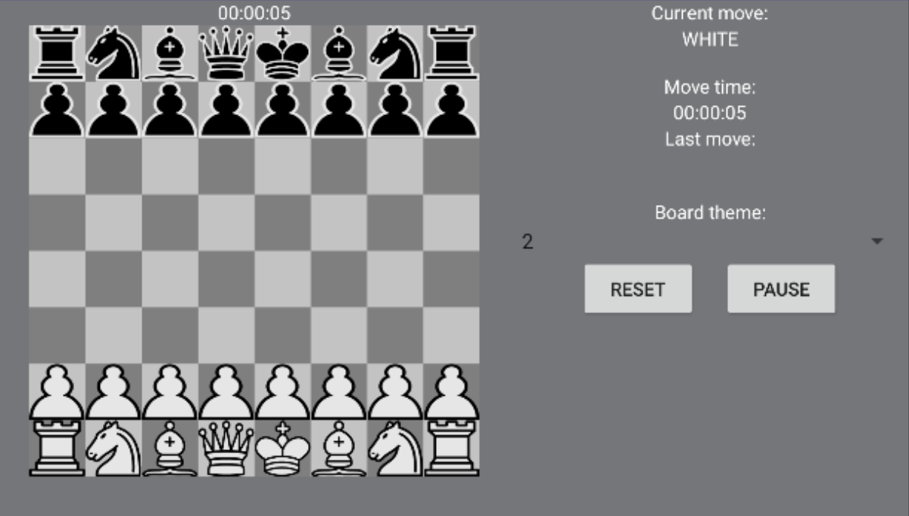
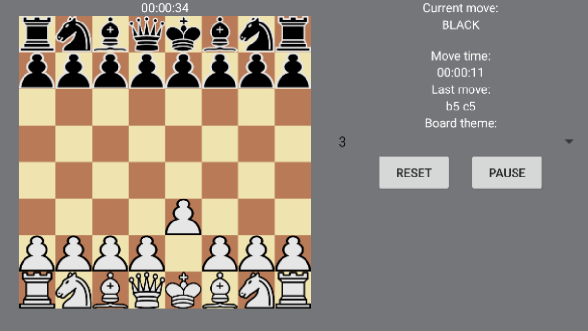
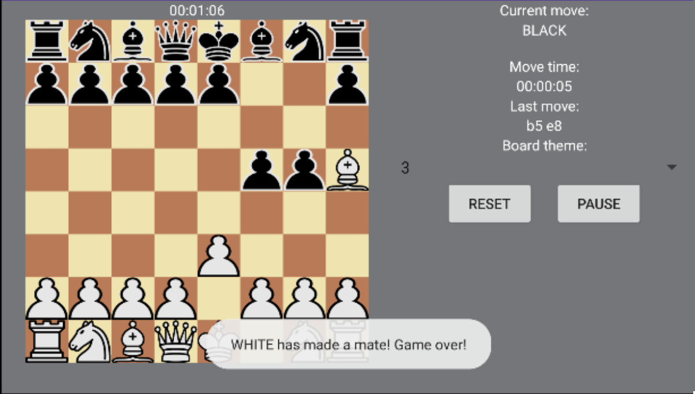
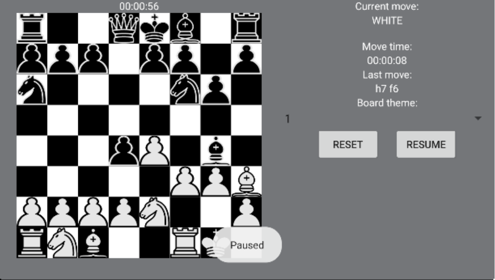

# ChessForAndroid

This is a chess app for Android being developed by KPI FICE IM-12 group student Nikita Sutulov.

## Features:

_Board theme change_

_Pause_

You can pause the game if you want to chill or to think about your move.

_Timers_

While playing, you can see timers showing the general game time and the current move time.

## How it looks:

